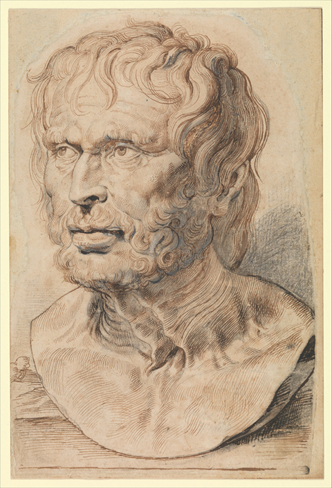

# Seneca - Selected Letters

- [Introduction](#index-intro) - description of - and motivation for -  this repository
- [Book I](#book-i) - letters 01-12
- [Book II](#book-ii) - letters 14-21
- [Notes](#notes) - works cited

 [_Bust of Pseudo-Seneca_](https://www.metmuseum.org/art/collection/search/459195), Peter Paul Rubens, 1600-1626. Robert Lehman Collection, Metropolitan Museum of Art.

## Index Intro
I first came across Seneca through the work of Nassim Nicholas Taleb - specifically his book Antifragile. There might be a popular conception of Stoic philosophers as unfeeling people, unmoved by the events of life. I've found myself more interested in Taleb's characterization of Stoics as 'Buddhists with an attitude problem'[1](#notes). 

Approximately 100 of Seneca's letters to his friend Lucilius are collected in **Seneca - _Selected Letters_**, as translated by Elaine Fantham. What follows are transcriptions of the introductions to each letter. Fantham's translation was chosen because of her fresh approach to the classics and view of 'history as a living thing'[2](#notes), in addition to her expertise on the subject. 

This 'indexing' exists as a live experiment in reading and study. I'd come across a primer on HOW TO STUDY[3](#notes) on Hacker News a while ago, and it recently resurfaced again on 'popular' page of Pinboard. There was advice on reading texts quickly the first time through, and then more studiously the second. The idea is to get an overview of the writing first, and then delve into unpacking the details. 

I thought I'd try that advice out here. Perhaps down the line there will be a tool or website built that accesses each letter and corresponding notes in a novel way.

## Book I

#### Letter 1 (Book I.1)
_In answer to Lucilius, who has declared himself determined to make the best use of his time._

#### Letter 2 (Book I.2) 
_On restlessness, whether in physical travel or indiscriminate reading._

#### Letter  3 (Book I.3)
_On the proper basis of real friendship. Seneca warns Lucilius against making a man into a friend before he knows the man's character. But once someone has become a friend, he should be trusted and should share one's anxieties._

#### Letter 4 (Book I.4)
_On cultivating tranquility of mind and rejecting fear of death. Seneca starts from the comparison of a man becoming wise to a boy coming of age. It is equally foolish to scorn life and to fear death, and calmness can be achieved by learning that there is no reason to fear death, which is always with us._

#### Letter 5 ( Book I.5)
_On avoiding conspicuous austerity and the meaning of 'living according to Nature.' Adopting a severe lifestyle is one aspect of the wider issue of shunning the crowd, and actually withdrawing or retiring from public life raised in letters 7 and 8._

#### Letter 6 (Book I.6)
_Seneca offers Lucilius evidence of his own gradual advance in virtue._

#### Letter 7 (Book I.7)
_On the gratuitous cruelty of public executions in the arena and the moral harm done by contact with the crowd of spectators and their vicious relish for human suffering. But any contact with vicious men will only corrupt (•6). One has to avoid either imitating common attitudes or hating them, and teach only those ready to learn, not trying to convert a general audience. Even a single listener, or none at all, is good enough for the man behaving rightly. It is important to distinguish the enforced combats of batches of condemned criminals sent to fight until one of their opponents should kill them, from the skilled combat of trained gladiators in appropriate defensive armour. See M. Wistrand,_ Entertainment and Violence in Rome in the First Century AD _(Oxford: Oxford UP, 1978)._

#### Letter 8 (Book I.8)
_On withdrawal_ (secedere): _Seneca continues the theme of withdrawal from letter 7, but adds that his withdrawal is a positive retirement in order to write for the future enlightenment of posterity. Lucilius should shun the tastes and indulgences of the crowd. Instead Seneca turns to recommendations (based on his own example) for a life spent in withdrawal even from accepted social obligations._

#### Letter 9 (Book I.9)
_On self-sufficiency and the value of friendship. Seneca returns to the theme of friendship from a new point of view; the wise man should not need friends. But he does need them to be objects of his kindness, and Seneca distinguishes between self-interested and altruistic friendship._

#### Letter 10 (Book I.10)
_On the potential harm from bad company and the need to address only honest prayers to God even away from other men._

#### Letter 11 (Book I.11)
_On physical blushing and moral bashfulness. Seneca argues that there are physical reactions a man cannot control and should not be blamed for. In •8 he uses his 'Epicurean'_ envoi _to change to a different theme; the recommendation to imagine one's actions under the observation of a respected and virtuous man._

#### Letter 12 (Book I.12)
_Seneca uses a visit to his childhood home to illustrate how the  decay in his country villa, the decline of plane trees he himself planted, and finally the ageing of his childhood playmate have convinced him of his advanced age. This leads to consideration (•6) of each day as a fraction of a larger unit of natural time and the span of life, and the proper way to look forward to death, not unlike the maudlin Pacuvius (•8) who staged a performance of his own funeral every evening._

## Book II

#### Letter 14 (Book II.2)

__Seneca discusses human concern for one's own body, and fear of suffering physical pain, especially pain imposed upon us by an oppressor or tyrant figure. (By listing as potential oppressor the common people or a faction of the senate before mentioning a single autocrat, Seneca comes as near as he dare approach to his own situation under the power of Nero.)_

_The wise man will never provoke the anger of the crowd or the powerful individual, yet (•12) Cato in his wisdom opposed Pompey and Caesar both during ad before the outbreak of civil war._

_For Seneca, as for his nephew Lucan (especially in Book II of the Civil War), Cato serves as a safely removed model for the wise man's attitude, enabling Seneca to postpone indefinitely (•14) the larger issue of whether the wise man should even participate in public life._

#### Letter 15 (Book II.3)

_This letter too starts from concern with the body. Seneca deplores modern forms of physical training, but recognizes the value of fitness, and suggests simpler substitutes. (See also letter 83, ••1-5 on his own health regime.)_

#### Letter 16 (Book II.4)

_Compliments to Lucilius lead to warnings that he is not yet secure in his own moral stability. At •4 Seneca introduces the problematic issue of what is fated and cannot be averted. His injunction to obey fate gladly but fortune with resistance might have led to real confusion, so he relinquishes it (•6) for the simpler topic of living according to nature, not human opinions._

#### Letter 18 (Book II.6)

_It is the holiday season of the Saturnalia. Seneca debates how far to go along with society's increasing frivolity, and suggests an exercise in self-imposed austerity._

#### Letter 19 (Book II.7)

_Seneca congratulates Lucilius on his moral progress, and warns him against the distraction of his present public career and of worldly ambition._

#### Letter 21 (Book II.9)

_Seneca uses the unspecified anxieties of Lucilius to advise him about the triviality of external concerns and importance of being at peace with himself. This letter marks Seneca's adherence to the two traditions of philosophical letters of advice (Epicurus) and personal correspondence (Cicero), before moving on to Epicurus' precepts about reducing desires (••7-9) and praising the spirit of austerity symbolized by both the inscription and keeper of Epicurus' garden._

## Notes
[1] Commencement speech given at American University in Beirut. Youtube link, approximately halfway through.

[2] Obit for Elaine Fantham, Guardian

[3] HOW TO STUDY